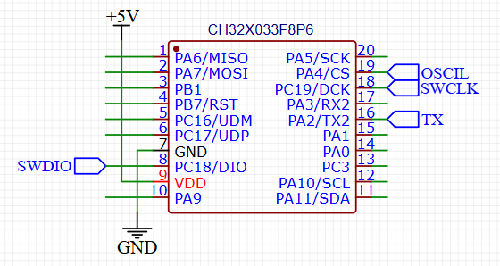
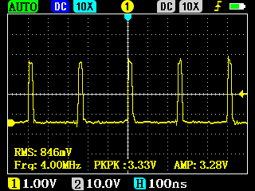
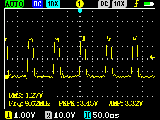

# Исполнение кода из RAM на CH32X033/35

## Зачем это нужно

Вдохновение пришло после статьи Павела Локтева: [Рассматриваем циклы процессора в контроллере CH32x035](https://habr.com/ru/articles/872890)

Ядро **QingKe V4** (CH32X033/CH32X035/CH32V203/307) не имеет **I-cache**, и код исполняется напрямую из Flash.

На низких частотах (например, 8 МГц) разницы между исполнением кода из Flash и RAM практически нет.  

Но начиная примерно с **16 МГц** становится заметно, что Flash не успевает выдавать инструкции каждый такт.  
Контроллер вставляет дополнительные задержки (wait states), и выполнение замедляется.  

Поэтому для кода, который критичен к скорости (например, "ногодрыги" для GPIO, bit-bang протоколы, точные задержки),  
имеет смысл поместить функцию в RAM и запускать её оттуда. 

> **Примечание:** "bit-bang" (от англ. *bit banging*) — это реализация цифровых протоколов (SPI, I²C, 1-Wire и др.) полностью программно, 
> путём ручного управления состоянием GPIO с нужными задержками, вместо использования встроенного аппаратного контроллера.  
> Такой способ сильно зависит от скорости выполнения кода и требует стабильных таймингов.

Решение: **вынести критичный код в RAM**. В RAM инструкции читаются за 1 такт, а короткие циклы выполняются быстрее и предсказуемее.

---

## Схема подключения



## Использование в коде

Функцию, которую нужно исполнять из RAM, отмечаем атрибутом:

```c
__attribute__((section(".highcode")))
```

Выглядеть это будет так:

```c
__attribute__((section(".highcode")))
void GPIO_Toggle(void)
{
    for (;;) {
        GPIOA->BSHR = 1 << PIN; // set
        GPIOA->BCR = 1 << PIN; // reset
    }
}
```

Но  этого недостаточно,нужно ещё настроить линкер и startup

---

## Настройка линкера и startup

### 1. В файле `Link.ld`

Перед секцией `.text` добавляем:

```asm
  	.highcodelalign : 
    {       
        . = ALIGN(4);
        PROVIDE(_highcode_lma = .); 
    } >FLASH AT>FLASH 
    
    .highcode : 
    {
        . = ALIGN(4);
        PROVIDE(_highcode_vma_start = .);
        *(.highcode);
        *(.highcode.*);
		. = ALIGN(4); 
        PROVIDE(_highcode_vma_end = .);
    } >RAM AT>FLASH
````

### 2. В файле `startup_ch32x035.S`

Перед 
```asm
 /* Load data section from flash to RAM */
	la a0, _data_lma:
```
добавляем этот asm код:

```asm
/* Load highcode code  section from flash to RAM */
2:
    la a0, _highcode_lma
    la a1, _highcode_vma_start
    la a2, _highcode_vma_end
    bgeu a1, a2, 2f
1:
    lw t0, (a0)
    sw t0, (a1)
    addi a0, a0, 4
    addi a1, a1, 4
    bltu a1, a2, 1b
```

[См. коммит 39376d5](https://github.com/dzanis/CH32X033_runinram_test/commit/39376d54b02a8320292dfd27363899bbf2fa3fe6)

---

## Тест скорости выполнения кода CH32X033 (Flash vs RAM) на 8–24 MHz

Замерял осциллографом (SigPeak DSO2512G) частоту на пине A4.

При тактовай частоте процессорного ядра (SYSCLK) 48MHz :

| Обычная функция из Flash: **\~4 МГц** | Функция в RAM: **\~9.5 МГц** |
| --- | --- |
|  |  |

Также проверил на остальных частотах :

|SYSCLK | Flash   | RAM     |
| ---   | ---     | ---     |
| 8MHz  | 2MHz    | 1.6MHz  |
| 12MHz | 3MHz    | 2.4MHz  |
| 16MHz | 2.6MHz  | 3.2MHz  |
| 24MHz | 4MHz    | 4.8MHz  |
| 48MHz | 4MHz    | 9.5MHz  |

Вывод: 
 - На **48 МГц** простой цикл в RAM может выполняться вдвое быстрее, чем в Flash.Прирост скорости более чем в **2 раза**.
 - Тактовая частота 48 МГц для контроллера CH32X033/35 не даёт преимуществ для процессорного ядра относительно тактовой частоты 24 МГц.
 - На высоких частотах (24–48 MHz) Flash упирается в ограничение скорости выборки и перестаёт масштабироваться, тогда как выполнение из RAM продолжает расти линейно. 
 - Код из Flash на **16 MHz** неожиданно медленнее, чем **12 MHz** (эффект предвыборки).

---

## Дополнительно про регистр 0xbc0 

* В проекте при необходимости можно изменить режим предвыборки из Flash в `startup_ch32x035.S`:

```asm
  /* Configure pipelining and instruction prediction */
    li   t0, 0x1f   /* можно заменить на 0x1c или 0x1e */
    csrw 0xbc0, t0
````
* Регистр **`0xbc0`** — внутренний CSR, управляющий аппаратными ускорителями ядра
  (предвыборка инструкций, предсказание переходов и т.п.).
  В документации на QingKe V4 он **не описан**; похожие регистры встречаются только у QingKe V3.
  Павел Локтев в своей [статье на Хабре](https://habr.com/ru/articles/872890) подчёркивает практический эффект,
  но **не раскрывает точного значения битов** (`0x1f`, `0x1c`, `0x1e` и т.д.).

* Типичные значения:

  * `0x1f` — включены все ускорители.
    Полезно для длинных функций и ?обычного? кода: предвыборка сглаживает доступ к Flash.
    Но в очень коротких tight-loop (например, GPIO ?ногодрыг?) может вносить лишние паузы (stall).
  * `0x1c` — отключает часть механизмов (вероятно агрессивную предвыборку).
    Даёт выигрыш в сверхкоротких циклах, уменьшая задержки и делая исполнение ровнее.
  * `0x1e` — промежуточный вариант, который Павел Локтев применял в более поздних экспериментах.

Позже от Павела Локтева вышло видео  [Начинаем создавать прошивку для измерения времени входа в прерывание CH32X035](https://youtu.be/UuWuPq0lPJE?si=TtcdL1p9G3bJF78C) где он уже заменял на `0x1e`.

Протестировал оба этих значения для регистра **`0xbc0`** :
---

|SYSCLK | Flash 0x1c | RAM 0x1c | Flash 0x1e | RAM 0x1e |
| ---   | ---        | ---      | ---        | ---      |
| 8MHz  | 1.6MHz     | 1.3MHz   | 1.6MHz     | 1.3MHz   |
| 12MHz | 2.4MHz     | 2MHz     | 2.4MHz     | 2MHz     |
| 16MHz | 2.6MHz     | 2.6MHz   | 2.6MHz     | 2.6MHz   |
| 24MHz | 4MHz       | 4MHz     | 4MHz       | 4MHz     |
| 48MHz | 4MHz       | 8MHz     | 4MHz       | 8MHz     |

Вывод: 
- Тест показал, что изменение регистра `0xbc0` на  `0x1c` и `0x1e` ведут себя одинаково.
- При `0x1c` и `0x1e` выполнение кода из Flash и RAM немного замедляется по сравнению с `0x1f`.
- Таким образом, режим `0x1f` остаётся оптимальным «по умолчанию» для большинства задач.
- Код из Flash на **16 MHz** неуступает **12 MHz**.

---

Открыть проект можно в **MounRiver Studio 2**  или в **Visual Studio Code + PlatformIO (platform-ch32v)** 


